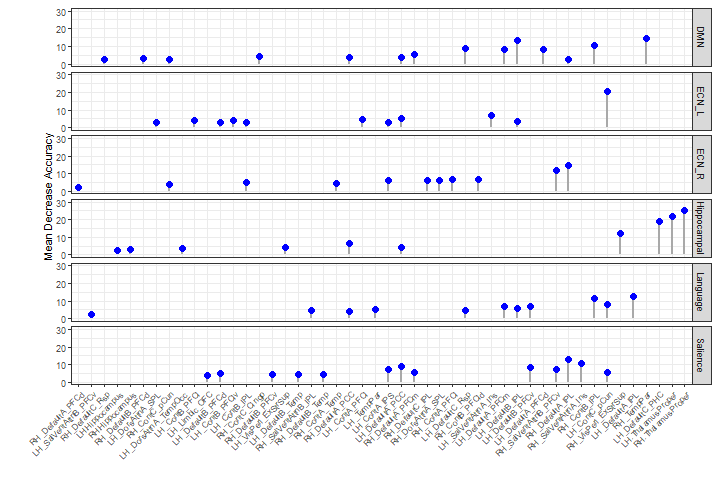
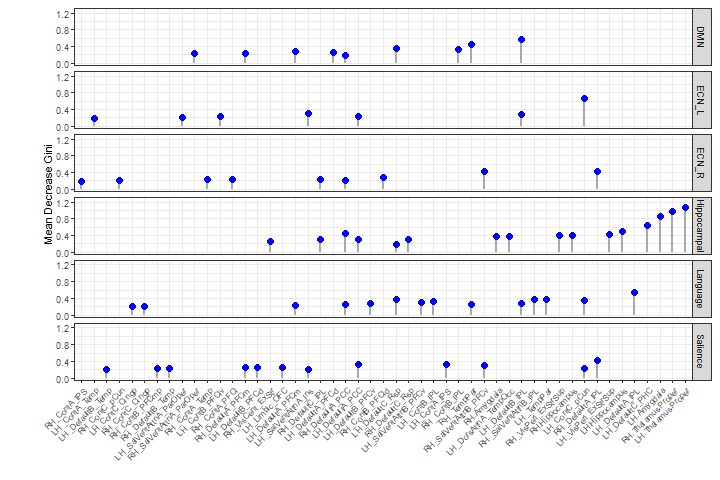
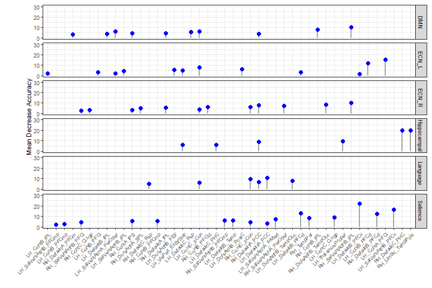
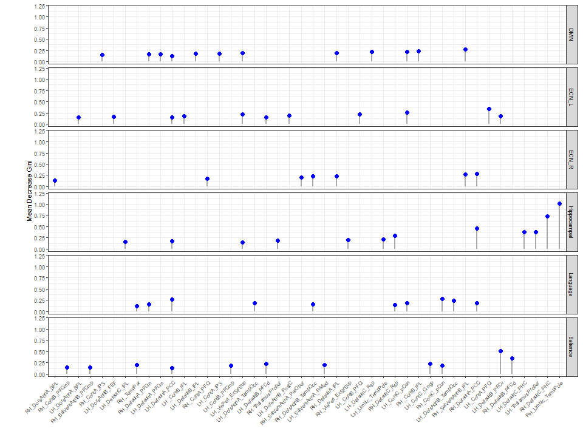
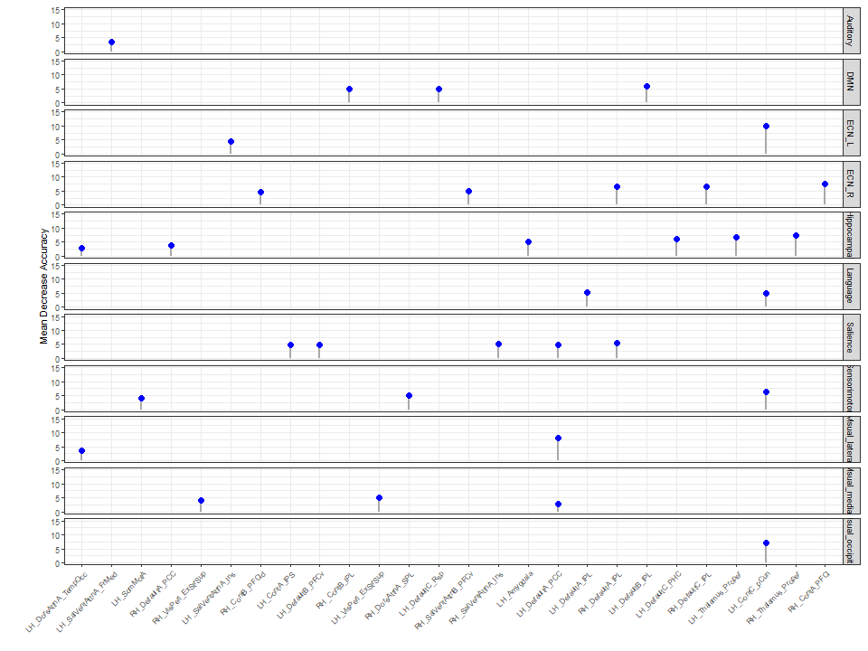
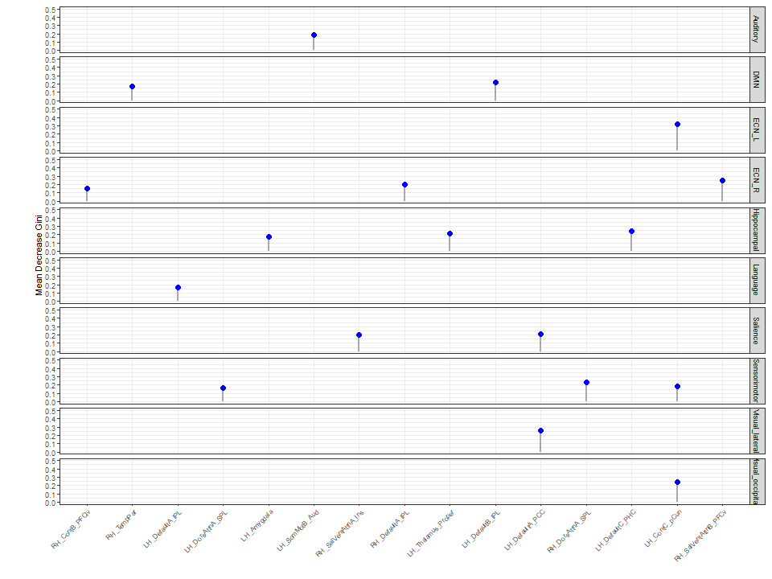
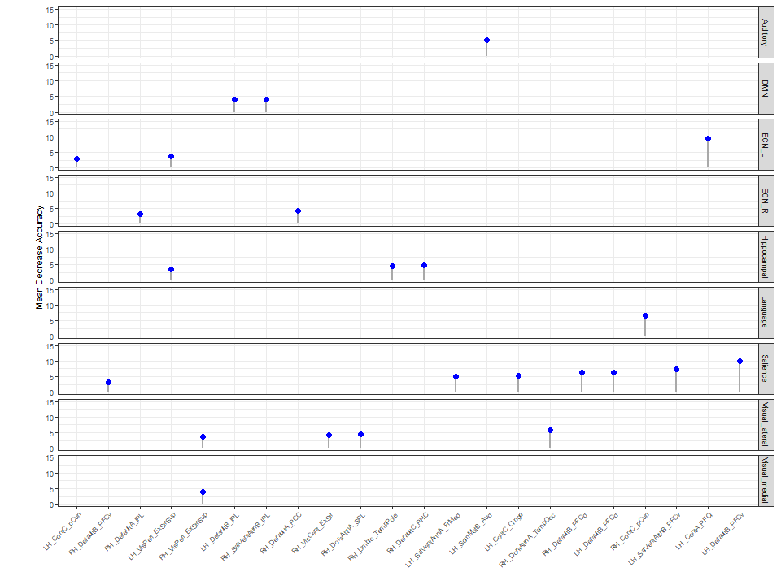
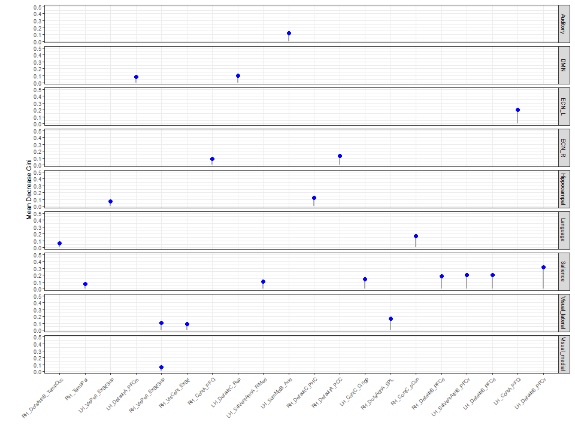

# Phenotyping Superagers using Resting-State Functional Magnetic Resonance Imaging: A Comparison of Penalised Regression and Random Forest

This project includes three parts:
## 1. Phenotyping Superagers with Penalised regression
This part is adapted from Dr Nathan Green @n8thangreen. Their project can be found under this link: https://github.com/n8thangreen/superager.penalised.regn.
I have reproduced the lolliplot graph with different set of parameters.
## 2. Phenotyping Superagers with Random Forest using Pre-selected Regions
### Analysis
[Random Forest by Network](scripts/randomforest_network.R) runs random forest model in each of the six preselected regions. Output file [Pre-selected RF Result 3T](data/randomforest_network_3T.RDS) & [Pre-selected RF Result 7T](data/randomforest_network_7T.RDS)  
[Important Nodes in Pre-selected Regions](scripts/rf_imp_network.R) identifies the most important nodes in each of the region. Here important nodes refer to nodes that have a high MDA/MDG score. 

### Output
[Importance Lolliplot](scripts/imp_lolliplot.R) produces all the lolliplots below.  

  
  

  
  

[Prediction Fit](scripts/output_rf_stats_plot.R) produces a scatter plot that compares the fit of 3T and 7T data (adapted from @n8thangreen).   
[Prediction Accuracy](output/rf_scatterplot_3T_7T.pdf)
## 3. Phenotyping Superagers with Random Forest using All Regions
### Analysis
[Repeated Random Forest on all Data](scripts/randomforest_includeall.R) runs the random forest model twice on nodes from all the regions. Output file [RF Result MDA 3T](data/rf_res_3T_includemda.RDS) & [RF Result MDG 3T](data/rf_res_3T_includemdg.RDS) & [RF Result MDA 7T](data/rf_res_7T_includemda.RDS) & [RF Result MDG 7T](data/rf_res_7T_includemdg.RDS) 
[Important Nodes in All Regions](scripts/supraimp_nodes_final.R) identifies the most important nodes out of nodes from all regions. 
### Output
[Importance Lolliplot](scripts/imp_lolliplot.R) produces all the lolliplots below.  

  
  

  
  

